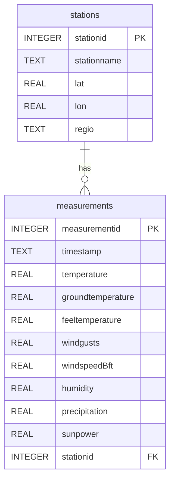

```mermaid
erDiagram
    stations {
        INTEGER stationid PK
        TEXT stationname
        REAL lat
        REAL lon
        TEXT regio
    }

    measurements {
        INTEGER measurementid PK
        TEXT timestamp
        REAL temperature
        REAL groundtemperature
        REAL feeltemperature
        REAL windgusts
        REAL windspeedBft
        REAL humidity
        REAL precipitation
        REAL sunpower
        INTEGER stationid FK
    }

    stations ||--o{ measurements : "has"
```
